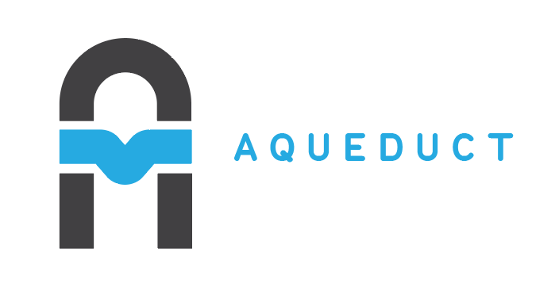

[](https://travis-ci.org/stablekernel/aqueduct)

`aqueduct` is a server-side framework written in Dart, focusing on productivity and testability.

There are three ways to get started, depending on your style of learning.

## The quick and dirty way for Dart developers

Just want to grab aqueduct and try it out? Just add the following to your pubspec.yaml:

```
aqueduct: any
```

## The best way

Need a walkthrough? Read the [tutorials](http://stablekernel.github.io/aqueduct/). They take you through the baby-steps of understanding how aqueduct is used to build web servers.

Installing Dart and `aqueduct` is covered in the [first chapter](http://stablekernel.github.io/aqueduct/tut/getting-started.html) and it's very quick.

If you don't yet know Dart, don't worry - it's easy to learn, especially if you come from Java, Objective-C, Swift and other C-like languages. We suggest the [language tour](https://www.dartlang.org/docs/dart-up-and-running/ch02.html) to get caught up to speed. You'll feel comfortable going through the `aqueduct` tutorials and cross-referencing the language tour at the same time.

## The up-and-running way

More of a learn as you go type? Install `aqueduct` as a global package:

```
pub global activate aqueduct
```

Then, create a new project (project names must be snake_case):

```
pub global run aqueduct:create -n my_project
```

This will create a new project complete with authentication, test harness, database schema generation and documentation generation. Make sure to see the `README.md` file in the new project for further instructions.

## Documentation

You can find the API reference [here](https://www.dartdocs.org/documentation/aqueduct/latest).
